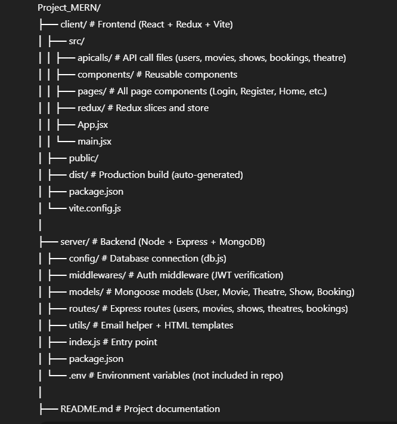
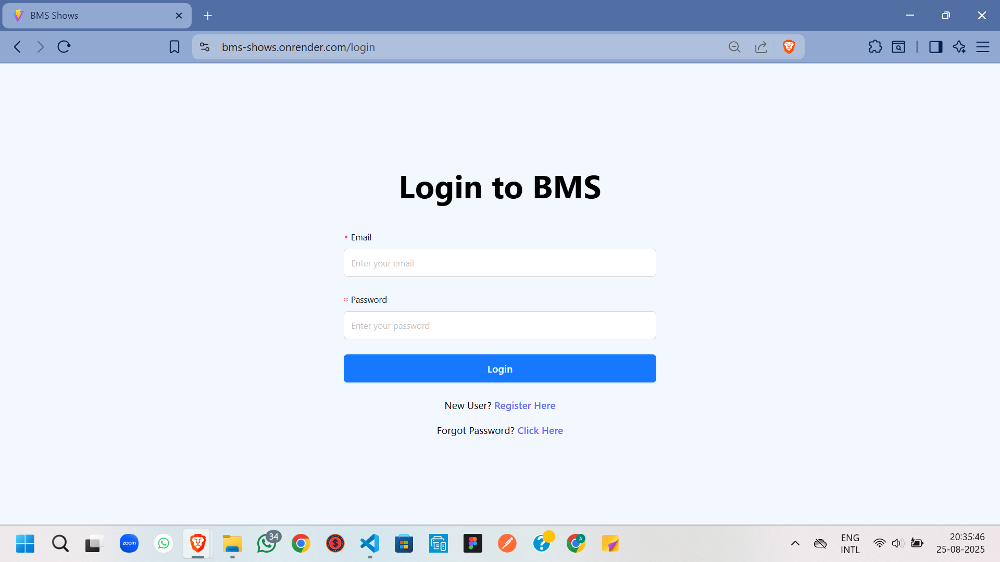
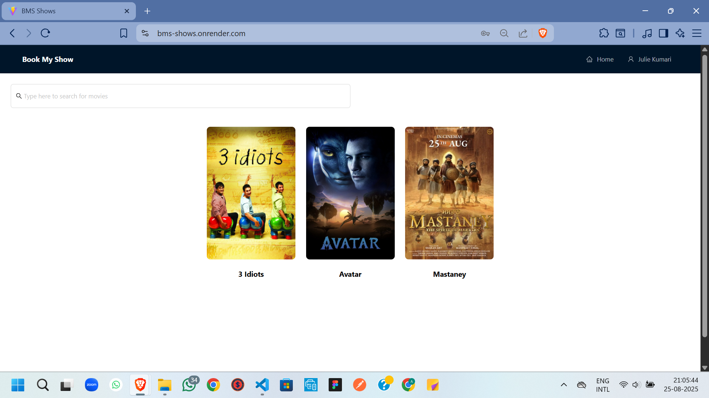
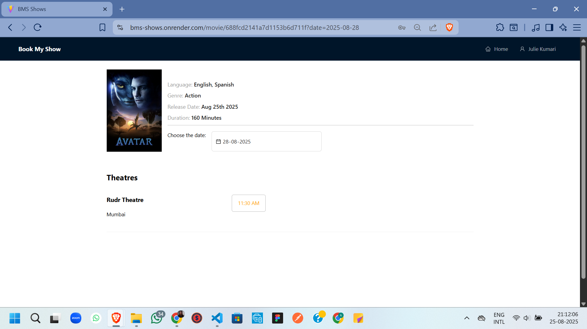
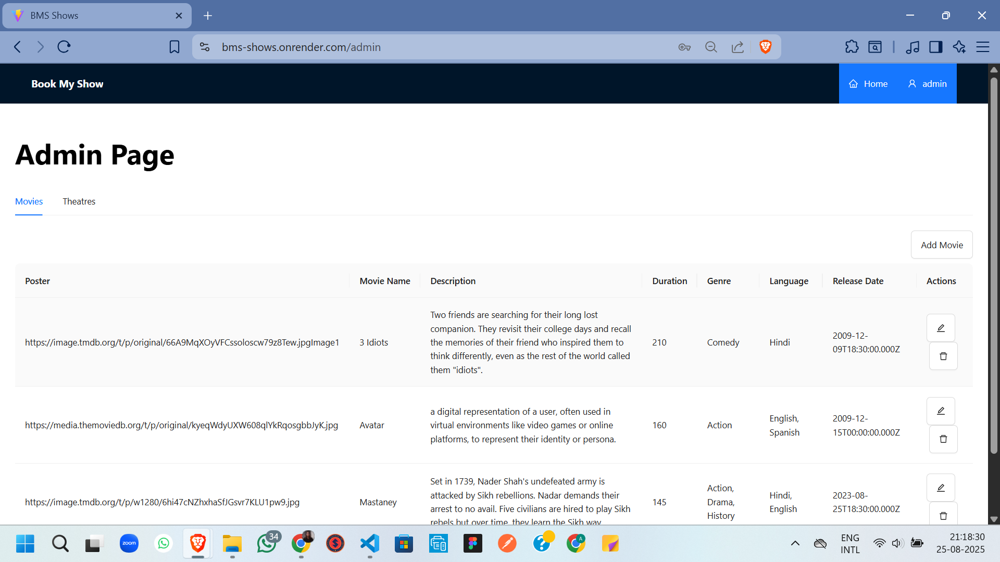
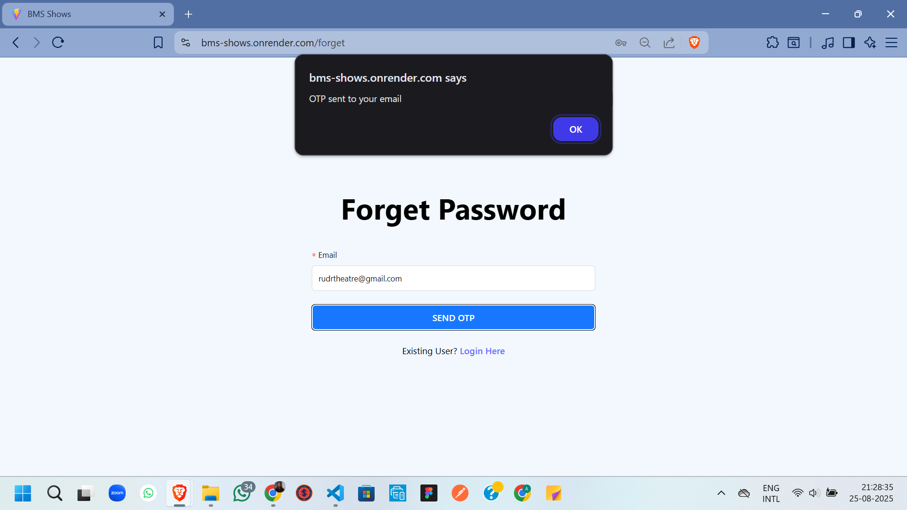

# Movie Ticket Booking System  (https://bms-shows.onrender.com/login)

## Project Overview

The "Movie Ticket Booking System" is a full-stack web application built using the MERN stack (MongoDB, Express.js, React, Node.js).

It allows users to :
=> Register, login, and manage their profiles
=> Browse movies and shows
=> Book and cancel movie tickets
=> Reset Passwords via OTP-based email verification

Admins and theatre partners can:
=> Manage movies, theatres and shows
=> View bookings and users
=> Only Admins can aprove the theatres for shows

## Folder Structure

    

## Installation and Setup

### 1) Clone the repository
    ....bash
         https://github.com/Julie-1156-Kumari/Project_MERN.git
         cd Project_MERN

### 2) Install Dependencies
    => For Client
        ----bash
            cd client
            npm install

    => For Server
        ----bash
            cd server
            npm install

### 3) Setup Environment Variables
    Inside server/.env add: (accordingly use your details as per requirements)
     
        MONGO_URI=your_mongodb_connection_string
        JWT_SECRET=your_secret_key
        stripe_key=your_stripe_secret_key
        SENDGRID_API_KEY=your_sendgrid_api_key

### 4) Run the project:
    => Start Backend:
        ----bash
            cd server
            npm start
    
    => Start Frontend:
        ----bash
            cd client
            npm run dev

## Features
    => User authentication (Register/Login with JWT & bcrypt)
    => Password reset via OTP email verificaiton
    => Role-Based access (Admin/ Theatre Partner, User)
    => Booking, Cancel and View Movies tickets
    => Admin: Manage theatres, shows and movies
    => Partner: Manage theatre and show scheduling
    => Email notification for bookings and password reset 
    => Responsive frontend with React + React

## Tech Stack
    => Frontend: React, Redux Toolkit, Vite, Tailwind CSS
    => Backend: Node.js, Express.js, JWT, bcrypt
    => Database: MongoDB (Mongoose ODM)
    => other Tools: Nodemailer(OTP & ticket emails), Postman (API testing), Stripe (trial payment)

## Screenshots
    1) Login/Register Page
        
    2) Home Page with Movies
        
    3) Ticket Booking Page
        
    4) Admin Dashboard
        
    5) Email OTP Example
        

## Deployment
    => Backend: Render
    => Database: MongoDB Atlas

# Author
Julie Kumari
https://github.com/Julie-1156-Kumari

